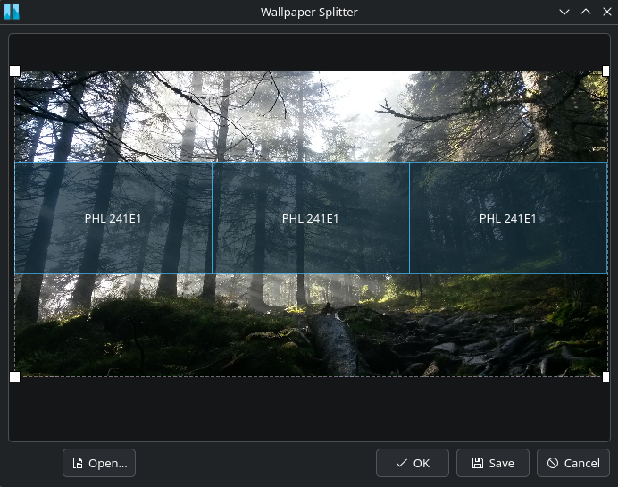

# Wallpaper Splitter

[](https://github.com/kstorbakken/wallpaper_splitter/actions/workflows/ci.yml)

> [!NOTE]
> This is the actively maintained fork of the original
> [Wallpaper Splitter](https://github.com/l0drex/wallpaper_splitter) project.
> Development, issues, and releases continue in this repository.

On KDE it is not possible to apply an image so that it spans across all of your screens.
This tool fixes that by splitting your image according to your screen setup.
It can also directly apply the image as your wallpaper.


Keep in mind that this only works with images, not with any fancy wallpaper engine or even dynamic wallpapers.


## 🚀 Features and roadmap

This is an overview of the currently supported functionality.

- [x] Split a given image
- [x] Apply the wallpaper from within the application
- [x] Adjust position
- [x] Adjust scale*
- [ ] Zooming into the scene and moving it around with the mouse wheel (scroll / click)
- [x] Command line tool
- [x] Support drag 'n drop

*there is a bug with diagonal scaling

## 💭 How to use it

_Some of these features might not be implemented yet._

1. Click <kbd>📂 Open</kbd> to select your image.
2. Resize or stretch the photo by dragging one of its corner handles. Hold <kbd>Shift</kbd> while dragging to preserve its aspect ratio. Adjust the position of your screens with <kbd>Left 🖱️</kbd> and the size with <kbd>Right 🖱️</kbd>.
   You can also zoom with <kbd>Ctrl</kbd> + <kbd>Mouse wheel</kbd> and move the scene around with <kbd>Middle 🖱️</kbd>.
3. Save the images that will be your wallpaper by clicking <kbd>💾 Save</kbd> or
   apply them directly by clicking <kbd>✔️ Ok</kbd>.

Note that the buttons in the screenshot are labeled in German.


## ⚙️ How does it work

Opening and splitting the image is straightforward.
Applying the image is done via a dbus call to the Plasma Shell,
for more on that see their documentation provided [here](https://develop.kde.org/docs/plasma/scripting/api/).


## 🛠️ Build and test

Wallpaper Splitter requires a C++20 compiler, CMake 3.20 or newer, Qt 6, and
KDE Frameworks 6 ConfigWidgets.

```sh
cmake -S . -B build -DCMAKE_BUILD_TYPE=Release -DBUILD_TESTING=ON
cmake --build build
ctest --test-dir build --output-on-failure
```

To install it after building:

```sh
cmake --install build
```

Tagged releases provide an AppImage plus `.deb`, `.rpm`, and Arch Linux
`.pkg.tar.zst` packages on the
[GitHub releases page](https://github.com/kstorbakken/wallpaper_splitter/releases).


## 💡 How to help

Bug reports and pull requests are welcome. See [CONTRIBUTING.md](CONTRIBUTING.md)
for the development workflow.
If you are able to implement these features directly into plasma, I would love to see that!


## License and authors

Wallpaper Splitter is licensed under the [GNU GPL v3](LICENSE). See
[AUTHORS.md](AUTHORS.md) for project authorship and maintenance history.
