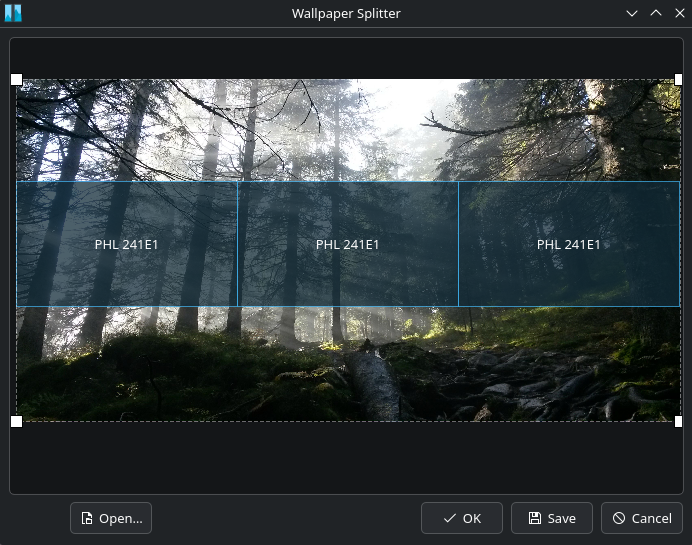

# Wallpaper Splitter

[](https://github.com/kstorbakken/wallpaper_splitter/actions/workflows/ci.yml)

> [!NOTE]
> This is an independent fork of the original
> [Wallpaper Splitter](https://github.com/l0drex/wallpaper_splitter) project.
> It contains additional maintenance and feature work, but is not an official
> continuation of or endorsed by the original project.

On KDE it is not possible to apply an image so that it spans across all of your screens.
This tool fixes that by splitting your image according to your screen setup.
It can also directly apply the image as your wallpaper.


Keep in mind that this only works with images, not with any fancy wallpaper engine or even dynamic wallpapers.


## 🚀 Features

This is an overview of the currently supported functionality.

- [x] Split a given image
- [x] Apply the wallpaper from within the application
- [x] Apply the wallpaper from the command line
- [x] Export with configurable filenames and collision handling
- [x] Browse, reapply, rename, and delete saved wallpaper sets
- [x] Remember input and export folders
- [x] Account for physical monitor sizes and bezel gaps
- [x] Adjust position
- [x] Adjust scale*
- [x] Zoom into the scene with <kbd>Ctrl</kbd> + <kbd>Mouse wheel</kbd>
- [x] Pan the zoomed preview with a middle-button drag
- [x] Command line tool
- [x] Support drag 'n drop

*there is a bug with diagonal scaling

See the [roadmap](ROADMAP.md) for ideas under consideration, including requests
originally filed in the original project's issue tracker.

## 💭 How to use it

1. Click <kbd>📂 Open</kbd> to select your image.
2. Resize or stretch the photo by dragging one of its corner handles. Hold <kbd>Shift</kbd> while dragging to preserve its aspect ratio. Adjust the position of your screens with <kbd>Left 🖱️</kbd> and the size with <kbd>Right 🖱️</kbd>.
   You can also zoom with <kbd>Ctrl</kbd> + <kbd>Mouse wheel</kbd> and pan the zoomed preview by holding the middle mouse button and dragging.
3. Click <kbd>Export</kbd> to save user-owned crop files, or <kbd>Apply</kbd> to
   write a managed wallpaper set and use it on the current Plasma activity.

Use <kbd>Settings…</kbd> to choose the remembered input and export folders, the
export filename template, and what happens when an export already exists.
Uncheck **Close the app after successfully applying a wallpaper set** to keep
the window open for further adjustments after Apply. This preference is remembered;
closing after Apply is enabled by default.
Templates support `{source}`, `{screen}`, `{number}`, `{revision}`, and
`{digest}`.

Use <kbd>Library…</kbd> to browse applied sets, with a preview, source image path,
creation time, monitor layout, crop mappings, and generated file paths. Reapply
requires the saved monitor positions and resolutions to match the current layout;
the original source image is not needed. Renaming changes the library label.
Deletion removes only managed files and is blocked while Plasma references a set
on any activity, or when those references cannot be checked. Switch those activities
to another wallpaper before deleting. Exports and source images are kept.

### Physical monitor sizes

Open <kbd>Monitors…</kbd> and enable **Use physical monitor sizes** when displays
have different pixel densities, uneven heights, or bezel gaps. Enter each panel's diagonal in inches, or its
visible width and height in millimeters. Reported dimensions are starting values;
verify them against your displays. If dimensions are unavailable, the dialog
starts with a 24-inch estimate.

Adjust **Left** and **Top** in millimeters to match the panels' real positions,
including bezel gaps. Positive top offsets move a panel down. Initial positions
follow the desktop arrangement; **Arrange left to right, top aligned** gives a
simple side-by-side starting point. The dialog previews the physical arrangement.

#### Example: same size, different resolutions

For two **27-inch, 16:9** monitors, one **1920 × 1080** and one **3840 × 2160**:

1. Enable **Use physical monitor sizes** and enter **27** in both Diagonal fields.
   Both panels should have the same width and height. Equal diagonals only imply
   equal dimensions when the aspect ratios match; use measured visible dimensions
   if needed, excluding the frame.
2. Click **Arrange left to right, top aligned** for a side-by-side starting point.
3. Adjust **Left** and **Top** to match the actual positions, as described below.
4. Click **OK**, review the crop overlay, and apply the wallpaper.

Both monitors now cover equally sized areas of the wallpaper. An object crossing
the seam keeps the same physical size even though one display has more pixels.
You do not need to change either monitor's resolution or desktop scaling.

#### Example: bezel gaps and height differences

Positions share a common origin; use **Left = 0, Top = 0** for the left panel.
If its visible width is **600 mm** and the distance from its visible right edge to
the next panel's visible left edge is **12 mm**, set the next panel's **Left = 612**.
Include both bezels and any space between them in that gap. The matching strip of
wallpaper is hidden so lines continue naturally across it.

If the right panel sits **10 mm higher**, set its **Top = -10**; if it sits
**10 mm lower**, use **Top = 10**. This works for monitors with identical sizes
and resolutions too. A wallpaper with a clear line crossing the screens can help
you check alignment and fine-tune the measurements.

These instructions are also available through **How to line up monitors…** in
the Monitors dialog.

Measurements are remembered per monitor, including disconnected displays. A
reported serial number identifies the monitor across ports; displays without a
unique serial use their connector. Saved dimensions rotate when a display moves
between landscape and portrait. Applying monitor settings or changing the display
layout refits and recenters the crop overlay; review the preview before applying.

Physical sizing affects both the GUI and command-line crops when enabled. Plasma's
display configuration is unchanged. Turn the option off to return to the normal
desktop-coordinate layout. Saved library sets retain their original crop mappings.

Preferences follow the XDG base-directory convention and are stored in
`~/.config/wallpaper-splitter/settings.conf`. Existing preferences from older
versions are migrated automatically. Managed wallpaper sets created by
<kbd>Apply</kbd> are stored in `~/.local/share/wallpaper-splitter/sets`.

## Command line

Passing an image starts the command-line exporter. Without `--destination`,
files are written to an `<image>_split` directory beside the source image.

```sh
wallpaper_splitter --destination ~/Pictures/spanned wallpaper.jpg
wallpaper_splitter --filename-template '{source}-{screen}' \
  --collision revision wallpaper.jpg
```

Use `--apply` to write a managed set and apply it to the current Plasma
activity. Export-only options cannot be combined with `--apply`.

```sh
wallpaper_splitter --apply wallpaper.jpg
```

## ⚙️ How does it work

Opening and splitting the image is straightforward. Exports remain owned by
the user. Applied crops and their JSON manifest are kept in the application's
local data directory so Plasma always references persistent files.

Applying the image is done via a D-Bus call to the Plasma Shell,
for more on that see their documentation provided [here](https://develop.kde.org/docs/plasma/scripting/api/).


## 🛠️ Build and test

Wallpaper Splitter requires a C++20 compiler, CMake 3.20 or newer, Qt 6, and
KDE Frameworks 6 ConfigWidgets.

```sh
cmake -S . -B build -DCMAKE_BUILD_TYPE=Release -DBUILD_TESTING=ON
cmake --build build
ctest --test-dir build --output-on-failure
```

To install it after building:

```sh
cmake --install build
```

An optional Arch Linux devcontainer provides the complete build environment
used by the maintainer. It can also produce a native pacman package from the
current working tree for installation on an Arch test host. See the
[development environment guide](DEVELOPMENT.md) for setup, package output, and
adapting the container to another distribution.

Tagged releases provide an AppImage plus `.deb`, `.rpm`, and Arch Linux
`.pkg.tar.zst` packages on the
[GitHub releases page](https://github.com/kstorbakken/wallpaper_splitter/releases).


## 💡 How to help

Pull requests are welcome. See [CONTRIBUTING.md](CONTRIBUTING.md) for the
development workflow and [ROADMAP.md](ROADMAP.md) for ideas under consideration.
The long-term hope is to contribute the core multi-screen spanning capability
directly to Plasma.


## License and authors

Wallpaper Splitter is licensed under the [GNU GPL v3](LICENSE). See
[AUTHORS.md](AUTHORS.md) for project authorship and maintenance history.
